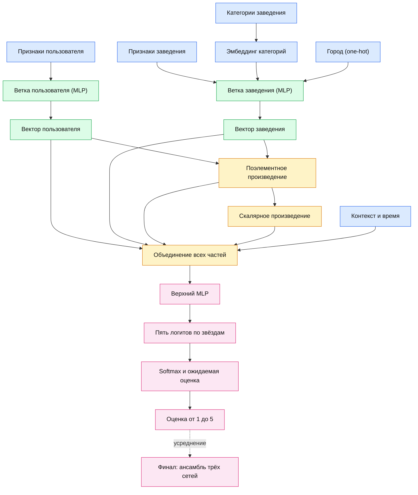
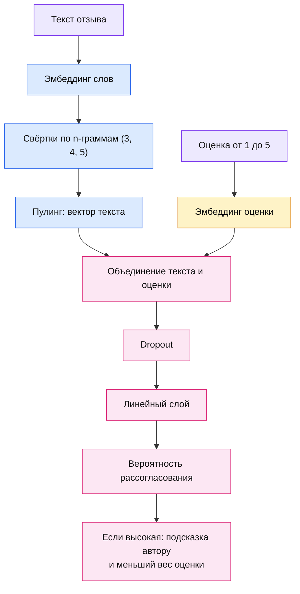

# Yelp DL Project

Этот репозиторий представляет собой учебный проект по **глубинному обучению** на данных платформы **Yelp**.

## О проекте

Yelp - платформа, где люди оставляют отзывы, оценки и короткие заметки о ресторанах, кафе и
услугах. На этих данных мы решаем две связанные задачи, образующие один продуктовый сценарий.

Бизнес-цель - рекомендовать пользователю самые релевантные заведения. Наш разведочный анализ выявил
проблему, которая сильно портит точность любой модели: рейтинг «грязный» - у многих отзывов тональность текста расходится с собственной оценкой. Значит, прежде чем рекомендовать, отзывы стоит почистить - отсюда и вторая
задача.

- **Рекомендации.** Полносвязная сеть по табличным признакам пользователя и заведения предсказывает, на сколько звёзд человек оценит место, и собирает подборку «специально для вас».
- **Анализ отзывов.** Модель читает текст: определяет тональность, выделяет аспекты (еда,
  сервис, цена) и ищет, когда тональность расходится с оценкой. Мы придумали два применения модели, которые позволяет сделать рейтинг более корректным: при публикации отзыва с «нестыкующейся» оценкой - мягкая UX-подсказка («отзыв скорее негативный, а стоит 5 звезд -
  всё верно?»), кроме того можно проводить регулярные чистки рейтинга от таких отзывов или просто искать все такие отзывы в базе и учитывать их с меньшим весом.

Поверх моделей мы написали тонкий слой инфраструктуры - он делает запуск воспроизводимым и
настраиваемым под разные цели. Срез датасета задаётся в одном месте и подхватывается всеми
ноутбуками, а два флага в `.env` позволяют включать/выключать логирование экспериментов (MLflow) и
генерацию графиков для презентации (папка `artifacts/`).

Полный [Yelp Open Dataset](https://www.kaggle.com/datasets/yelp-dataset/yelp-dataset) - это около
7 млн отзывов по десяткам городов (~9 ГБ). Мы сознательно работаем не со всем датасетом, а со
**срезом из нескольких городов** - по нескольким причинам:

- **помещается в память** - срез целиком грузится в RAM, без потоковой обработки на каждом шаге;
- **быстрые итерации** - обучение и EDA занимают минуты, а не часы;
- **воспроизводимость** - фиксированный срез даёт стабильные и сравнимые между запусками результаты;
- **контроль над данными** - вместо перекошенного «среднего по всем рынкам» берём сбалансированный и
  географически разнообразный набор;

Срез, как было написано ранее, мы выбираем по определенным критериям: берем три штуки из городов с достаточным количестовом отзывов со сбалансированными классами оценок и максимумом типсов. По умолчанию это:

> **Tucson, AZ + St Petersburg, FL + Edmonton, AB** - ~665 тысяч отзывов, ~209 тысяч пользователей,
> ~17.5 тысяч заведений, ~92 тысяч типсов; классы оценок сбалансированы, города географически разные

## Начало работы

### 1. Получение токена Kaggle
Для локальной загрузки и отчистки датасета мы написали bootstrap-скрипт, для использования которого необходим Ваш OAuth-токен. Инструкция по получению и правильному размещению токена:
1. Зайдите на [kaggle.com](https://www.kaggle.com) -> аватар -> **Settings** -> раздел **API** ->
   **Create New Token**.
2. Скопируйте шаблон и впишите токен:
   ```bash
   cp .env.example .env
   # затем откройте .env и впишите значение KAGGLE_API_TOKEN=KGAT_...
   ```

В `.env` также есть три флага (по умолчанию `false`), об этих флагах мы уже писали выше:

- `ENABLE_LOGGING` - включает логирование экспериментов с моделями (используется на этапе обучения).
- `ENABLE_ARTIFACTS` - сохранять ли графики EDA в `artifacts/` (при `false` ноутбуки только
  показывают графики, на диск не пишут).
- `ENABLE_FAST_DEV_RUN` - сделать ли быстрый прогон для второй задачи с маленьким сэмплом и одной эпохой для проверки работоспособности пайплайна.

### 2. Bootstrap

```bash
./setup.sh
```

Скрипт создаёт виртуальное окружение `.venv`, ставит зависимости, читает OAuth-токен Kaggle из `.env`,
скачивает датасеты и собирает из них срез по умолчанию (города выше) в parquet.
Срез параметризуется - можно собрать свой набор городов и проверить модели на нём. Примеры:

```bash
./setup.sh --cities "Tampa, FL;Boise, ID"   # свой набор (ключи "City, ST" через ;)
./setup.sh --city "New Orleans" --state LA  # один город
```

> **Windows:** `setup.sh` рассчитан на bash (macOS/Linux). На Windows используйте WSL либо
> выполните настройку окружения вручную:

```bash
python -m venv .venv && source .venv/bin/activate
pip install -r requirements.txt
python scripts/download.py
python scripts/preprocess.py
```

## Архитектура финальной модели для рекомендательной системы

Архитектуру удобно смотреть с помощью схем ниже (нарисованы через [mermaid](https://mermaid.js.org/syntax/flowchart.html)).

Финальная модель - это **среднее трёх одинаковых сетей**, обученных с разной случайной инициализацией
(усреднение делает прогноз устойчивее). Сама сеть, **InteractionMLP**, работает так:

1. **Две вектора.** Признаки пользователя и признаки заведения сжимаются в два коротких вектора - `u` (вкусы пользователя) и `v` (профиль места).
2. **Явное сравнение векторов.** Модель не просто склеивает `u` и `v`, а сразу считает, насколько они
   «совпадают»: модель считает поэлементное произведение `u` и `v` (где именно сходятся) и скалярное произведение `u` и `v` (общая совместимость)
3. **Голова-классификатор.** Вместо одного числа сеть выдаёт **вероятности оценок от 1 до 5**, а как ответ модели мы отдаем средневзешенное: `ŷ = Σ p(k) * k`. Для оценок, которые на Yelp в большинстве случаев либо 1 либо 5, такой подход сильно точнее обычной регрессии.

Каждая ветка и финальный блок - это набор обычных полносвязных слоёв `Linear -> BatchNorm -> ReLU -> Dropout(0.2)`.



## Архитектура финальной модели для детектора расхождений

Финальная модель для детектора расхождений оценки и тональности текста - **MismatchNet**: она объединяет два сигнала - что написано в отзыве и какая выставлена звезда - и оценивает вероятность, что они не согласованы.



## Структура репозитория

```
root/
├── README.md                   # этот файл
├── .env.example                # шаблон для токена Kaggle (копируется в .env)
├── .env                        # реальный токен (создаётся вручную)
├── .gitignore
├── requirements.txt            # зависимости Python
├── setup.sh                    # bootstrap: venv + скачивание + препроцессинг
├── clear_ipynb.sh              # удаляет все выводы ноутбуков 
├── _constants.py               # общие пути и имена файлов
│
├── scripts/
│   ├── _env.py                 # загрузчик .env
│   ├── download.py             # скачивает Yelp Open Dataset через Kaggle API
│   ├── preprocess.py           # нарезает выбранные города, JSONL преобразует в parquet (потоково)
│   └── build_mismatch_dataset.py  # синтетический датасет для детектора «текст ↔ оценка»
│
├── notebooks/
│   ├── 01_eda_raw.ipynb             # анализ сырого датасета + выбор городов-среза
│   ├── 02_eda_slice.ipynb           # глубокий EDA готового среза
│   ├── 03_task1_dataset.ipynb       # сборка единого датасета Задачи 1 (join таблиц + чистка утечек)
│   ├── 04_task1_rating_mlp.ipynb    # Задача 1: полносвязная сеть, предсказание оценки, сравнение архитектур
│   ├── 05_task2_text_models.ipynb   # Задача 2: TextCNN / BiLSTM / DistilBERT определяет тональность текста
│   └── 06_task2_mismatch_detector.ipynb  # Задача 2: соответствует ли текст оценке
│
├── data/
│   ├── raw/                    # необработанный датасет Yelp
│   ├── processed/              # срез выбранных городов (business/reviews/users/tips)
│   └── mismatch/               # датасет для детектора соответствия текста оценке
│
├── artifacts/                  # генерируемые артефакты: графики, скейлеры, словари (не хранятся в репозитории)
├── logs/                       # веса всех прогонов моделей (метрики/параметры - в mlflow.db)
│   ├── task1/                  #   прогоны Задачи 1 + final/ (ансамбль и одиночная модель)
│   ├── task2_mismatch/
│   └── task2_text/
└── reports/                    # eda_stats.json, selected_cities.json, task1_model_report.md, task1_model_metrics.json
```